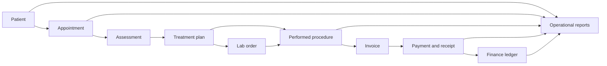

# Ethiopian Dental Clinic ERP Product Plan

## Product intent

Build a clinic operating system that feels native to Ethiopian teams and patients while preserving English interoperability. The product should support the complete clinical-to-cash journey, use PostgreSQL as the source of truth, enforce tenant isolation and RBAC in FastAPI, and keep JavaScript/TypeScript limited to the frontend.

## Ethiopia-ready product foundation

These are cross-cutting requirements, not a final translation pass:

- English and Amharic from the first production release, with terminology reviewed by Ethiopian dental staff. Keep the message catalog ready for Afaan Oromo and Tigrinya.
- Store locale per user and preferred communication language per patient.
- Use Unicode-safe search and sorting for Ethiopian names. Do not force a Western first-name/last-name assumption: support given name, father’s name, grandfather’s name, and a display name.
- Canonical Gregorian timestamps in PostgreSQL with Ethiopian calendar display/input support at the UI boundary.
- `Africa/Addis_Ababa` as the clinic-default timezone, configurable per tenant.
- ETB as the default currency with configurable currency and tax/fee rules. Never hardcode a tax rate.
- Ethiopian contact fields: `+251` phone normalization and region, city, sub-city, woreda, kebele, landmark, and free-form address support.
- Configurable receipt/invoice identity fields, including clinic legal name and optional tax identifiers, without embedding regulatory assumptions in code.
- Cash, bank transfer, card, and mobile-money payment methods modeled behind payment adapters.
- Ethiopian people and clinic environments in patient-facing photography and realistic Ethiopian names/data in demos.
- Low-bandwidth-friendly screens, printable A4 receipts and treatment plans, and reliable keyboard workflows for front desks.
- Audit trails, soft deletion, RBAC permissions, and hospital/clinic tenant isolation on every clinical and financial mutation.

## Delivery order: business dependency first

The fastest route to business value is one complete patient-to-payment loop. Each phase must ship as a usable vertical slice rather than a disconnected group of tables.

### Phase 0 — Clinical and financial foundation

- Staff identity, clinic tenancy, RBAC permissions, audit log, localization, ETB money type, document storage, sequential clinic-scoped numbers, and PostgreSQL/Alembic baseline.
- Core roles: owner/admin, dentist, dental assistant, receptionist, cashier/accountant, lab coordinator, and read-only auditor.
- Success gate: a tenant cannot read or mutate another clinic’s data; all protected actions have explicit permissions and audit records.

### Phase 1 — Patient Management

- Patient registration.
- Patient profile.
- Medical and dental history.
- Previous treatments.
- Patient records and documents.
- Duplicate detection using normalized phone plus clinic-scoped demographic checks.
- Preferred language, consent, emergency contact, and Ethiopian address/name model.
- First win: front desk can register, search, update, archive, and open a complete Patient 360 profile.

### Phase 2 — Appointment Management

- Appointment booking.
- Dentist schedule and chair/resource availability.
- Rescheduling and cancellation with reason history.
- Appointment history.
- Check-in, no-show, waitlist, and follow-up reminders.
- First win: receptionist can move a patient from search to a conflict-free booked slot in under a minute.

### Phase 3 — Assessment & Treatment Management

- Dental examination and assessment.
- Diagnosis.
- Dental chart.
- Treatment plan with sequenced items and estimated ETB cost.
- Procedures performed.
- Treatment progress and clinical notes.
- Follow-up tracking.
- Versioned clinical records, attachments, consent, tooth/surface notation, and dentist sign-off.
- First win: a dentist can assess a patient, approve a treatment plan, perform an item, and schedule the next follow-up without re-entering data.

### Phase 4 — Billing & Payments

- Invoices and line items generated from performed procedures.
- Payments and allocations.
- Printable/email receipts.
- Controlled discounts with permission and reason.
- Insurance policy, authorization, claim, and patient responsibility tracking.
- Outstanding balances, deposits, credit, refunds, and write-offs.
- First win: cashier can collect a partial or full ETB payment and produce a traceable receipt while the patient balance updates transactionally.

### Phase 5 — Dental Laboratory Management

- Lab orders.
- Crowns, bridges, dentures, aligners, and configurable appliance types.
- Lab status tracking from draft to delivered/fitted.
- Lab costs and supplier balance.
- Tooth/shade/specification details, due dates, attachments, remakes, and patient/treatment-plan linkage.
- First win: the clinic can see every overdue case and its clinical and cost impact from one queue.

### Phase 6 — Accounting & Finance

- Revenue and income ledger sourced from posted payments.
- Expenses and supplier payments.
- Dentist commission rules and statements.
- Cash flow and cash-drawer reconciliation.
- Financial reports with immutable posting periods and corrections through reversals, not silent edits.
- First win: daily close reconciles receipts, payment methods, expenses, and cashier responsibility.

### Phase 7 — Reports & Dashboard

- Patient statistics.
- Appointment statistics.
- Treatment reports.
- Revenue reports.
- Dentist performance.
- Clinic performance.
- Role-specific dashboards, date/clinic/dentist filters, ETB totals, exports, and metric definitions shared with the transaction model.
- First win: owner and clinical lead see operational exceptions and business performance without exporting raw data.

## Core workflow and dependency map

## Permission model

Use permissions rather than role-name checks inside endpoints. Initial permission groups:

- `patients.read`, `patients.create`, `patients.update`, `patients.archive`, `patients.history.manage`.
- `appointments.read`, `appointments.book`, `appointments.reschedule`, `appointments.cancel`, `schedules.manage`.
- `assessments.manage`, `diagnoses.manage`, `charts.manage`, `treatment_plans.manage`, `procedures.perform`, `clinical_notes.sign`.
- `invoices.manage`, `payments.collect`, `payments.refund`, `discounts.apply`, `insurance.manage`, `balances.write_off`.
- `lab_orders.manage`, `lab_orders.update_status`, `lab_costs.read`, `lab_costs.manage`.
- `expenses.manage`, `commissions.manage`, `cash_close.manage`, `financial_reports.read`.
- `reports.clinical`, `reports.operational`, `reports.financial`, `reports.export`.

Every repository operation must require a tenant context derived from the verified principal; `hospital_id` or `clinic_id` must never be trusted from request payloads.

## Release gates for every phase

- Black-box FastAPI contract tests for happy path, validation, permission denial, and tenant isolation.
- Real PostgreSQL integration tests for transactions, monetary precision, uniqueness, cascades, and concurrency-sensitive numbering.
- English and Amharic visual review at desktop and mobile widths.
- Keyboard navigation, focus visibility, contrast, print layout, loading, empty, error, and success states.
- Audit record for protected mutations and no sensitive clinical data in logs.
- Migration, rollback, seed/demo data, and operational runbook updated before release.

## Immediate implementation backlog

1. Complete the shared localization catalog and translate authentication, navigation, patient registration, Patient 360, and appointment booking.
2. Extend the PostgreSQL patient model for Ethiopian naming, address, preferred language, emergency contact, medical history, and duplicate detection.
3. Complete the Patient 360 FastAPI contracts and permission matrix.
4. Build schedule availability and appointment lifecycle on the same tenant/RBAC foundation.
5. Add assessment, dental chart, and versioned treatment-plan aggregates.
6. Generate invoices only from approved/performed clinical items, then add transactional ETB payment allocation and receipts.
7. Add lab workflow, finance ledger, and reports only after their source transactions are stable.
